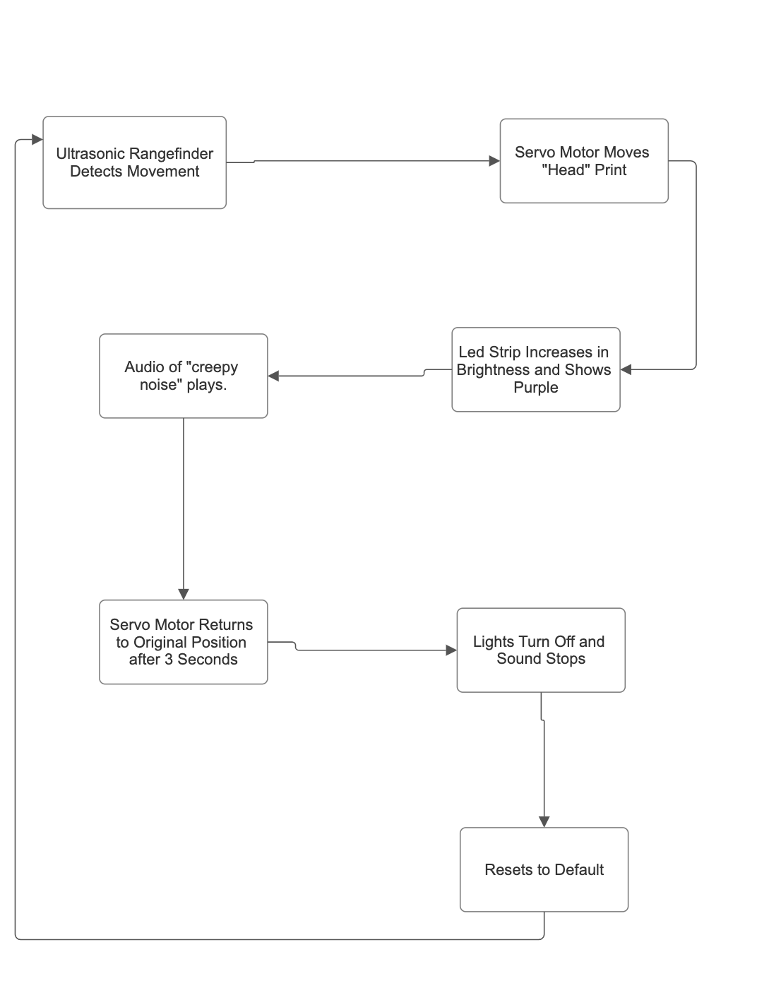
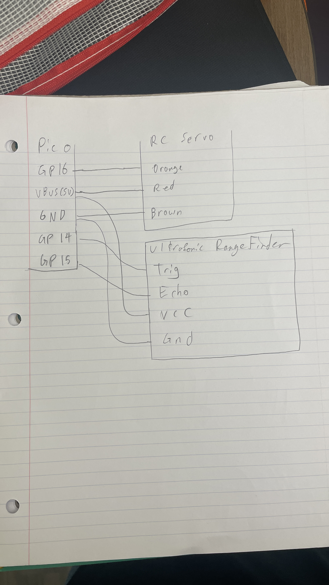

# ProjectPortfolio
All of my projects in a portfolio!


<h2> BLOCK DIAGRAM </h2>


<h2> CIRCUIT DIAGRAM </h2>



```
{
import time
import board
import pwmio
import audiopwmio
import audiocore
import adafruit_hcsr04
from adafruit_motor import servo
import neopixel

# Setup ultrasonic sensor
sonar = adafruit_hcsr04.HCSR04(trigger_pin=board.GP14, echo_pin=board.GP15)

# Servo setup
pwm = pwmio.PWMOut(board.GP16, duty_cycle=0, frequency=50)
servo = servo.Servo(pwm)
servo.angle = 90  # Default position

# NeoPixel setup
pixel = neopixel.NeoPixel(board.GP17, 8, brightness=0.0, auto_write=False)

# Audio setup
audio = audiopwmio.PWMAudioOut(board.GP9)
wave_file = open("charge.wav", "rb")
wave = audiocore.WaveFile(wave_file)

# Constants
SOUND_TRIGGER_DISTANCE = 15  # cm
SOUND_DURATION = 4  # seconds
SERVO_DEFAULT = 0
SERVO_OPEN = 120
SERVO_HOLD_TIME = 3  # seconds
LIGHT_HOLD_TIME = 3  # seconds

# State flags
object_detected = False
sound_triggered = False
sound_start_time = 0
servo_motion_active = False
servo_motion_start = 0
light_on = False
light_start_time = 0

print("System initialized. Starting loop...")

while True:
    now = time.monotonic()

    try:
        distance = sonar.distance
        print(f"Distance read: {distance:.1f} cm")

        if distance <= SOUND_TRIGGER_DISTANCE:
            if not object_detected:
                object_detected = True
                sound_triggered = False
                servo_motion_active = True
                servo_motion_start = now
                light_on = True
                light_start_time = now
                print("Object detected: starting servo and lights")

            # Trigger sound once
            if not sound_triggered and not audio.playing:
                audio.play(wave)
                sound_start_time = now
                sound_triggered = True
                print("Audio triggered")

        else:
            object_detected = False
            # Do not stop audio here — let it finish naturally

    except Exception as e:
        print(f"Sensor error: {e}")
        object_detected = False
        # Do not stop audio here either

    # Stop sound after 4 seconds
    if sound_triggered and now - sound_start_time >= SOUND_DURATION:
        if audio.playing:
            audio.stop()
            print("Audio stopped after 4 seconds")
        sound_triggered = False

    # Servo motion logic
    if servo_motion_active:
        elapsed = now - servo_motion_start

        if elapsed < 1.5:
            angle = SERVO_DEFAULT + int((SERVO_OPEN - SERVO_DEFAULT) * (elapsed / 1.5))
            servo.angle = angle
            print(f"Sweeping open: {angle}°")
        elif elapsed < 1.5 + SERVO_HOLD_TIME:
            servo.angle = SERVO_OPEN
            print("Holding open at 120°")
        elif elapsed < 1.5 + SERVO_HOLD_TIME + 1.5:
            return_elapsed = elapsed - (1.5 + SERVO_HOLD_TIME)
            angle = SERVO_OPEN - int((SERVO_OPEN - SERVO_DEFAULT) * (return_elapsed / 1.5))
            servo.angle = angle
            print(f"Returning to default: {angle}°")
        else:
            servo.angle = SERVO_DEFAULT
            servo_motion_active = False
            print("Servo motion complete")

    # NeoPixel light logic
    if light_on:
        if now - light_start_time < LIGHT_HOLD_TIME:
            pixel.brightness = 1.0
            for i in range(8):
                pixel[i] = (128, 0, 128)
            pixel.show()
        else:
            pixel.brightness = 0.0
            for i in range(8):
                pixel[i] = (0, 0, 0)
            pixel.show()
            light_on = False
            print("Lights turned off after 3 seconds")

    time.sleep(0.05)


}
```